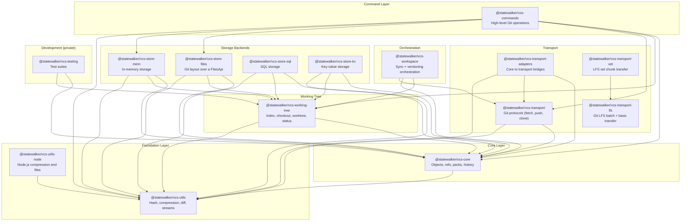

# Package Dependency Diagram

This diagram shows the runtime dependencies between the packages in this repository, as declared
in each `package.json` (`dependencies` and `peerDependencies`). Development-only dependencies are
not shown.

## Visual Diagram



## Dependency Table

| Package | Runtime dependencies in this repository | Other runtime dependencies |
|---------|------------------------------------------|----------------------------|
| `@statewalker/vcs-workspace` | core, working-tree, transport | `@statewalker/webrun-files-sync`, `@statewalker/webrun-content-store`, `@statewalker/webrun-files` |
| `@statewalker/vcs-commands` | core, working-tree, transport, store-files, store-mem, utils | |
| `@statewalker/vcs-transport` | core, utils | `@statewalker/webrun-streams`, `@statewalker/webrun-http-streams` |
| `@statewalker/vcs-transport-adapters` | core, transport, utils | `@statewalker/webrun-storage` |
| `@statewalker/vcs-transport-lfs` | | `@statewalker/webrun-content-store`, `@statewalker/webrun-http-streams` |
| `@statewalker/vcs-transport-xet` | transport-lfs | `@statewalker/webrun-content-store`, `@statewalker/webrun-content-transfer`, `@statewalker/webrun-streams`, `@statewalker/webrun-http-streams` |
| `@statewalker/vcs-store-files` | core, working-tree, utils | |
| `@statewalker/vcs-store-mem` | core, working-tree, utils | |
| `@statewalker/vcs-store-sql` | core, working-tree, utils | peer: `sql.js` |
| `@statewalker/vcs-store-kv` | core, working-tree, utils | |
| `@statewalker/vcs-working-tree` | core, utils | |
| `@statewalker/vcs-core` | utils | `@statewalker/webrun-storage` |
| `@statewalker/vcs-utils` | | `@statewalker/webrun-files`, `@statewalker/webrun-files-mem`, `pako` |
| `@statewalker/vcs-utils-node` | utils | `@statewalker/webrun-files-node` |
| `@statewalker/vcs-testing` (private) | core, working-tree | peer: `vitest` |

`@statewalker/vcs-integration-tests` (private) has no runtime dependencies; it uses the other
packages from its tests.

## Layer Descriptions

### Foundation Layer

**@statewalker/vcs-utils** - Algorithms with no VCS object model: hashing (SHA-1, CRC32, rolling
checksums), compression (zlib through pako by default, replaceable), text and binary diff, delta
encoding, streams, and pack helpers.

**@statewalker/vcs-utils-node** - Node.js-only helpers: native `zlib` compression and Node file
system adapters.

### Core Layer

**@statewalker/vcs-core** - The Git object model and history:

```
src/
├── common/        - Shared types (ids, persons, file helpers)
├── storage/       - Raw, binary, chunked and delta storage; webrun-storage adapters
├── pack/          - Pack file reading and writing
├── history/       - Blobs, trees, commits, tags, refs (the History interface)
├── serialization/ - Git object and pack serialization API
├── backend/       - Backend factories and registry
├── gc/            - Garbage collection and delta candidate selection
└── vcs-core/      - The VcsCore facade over @statewalker/webrun-storage
```

### Working Tree

**@statewalker/vcs-working-tree** - Index/staging, checkout state, worktree access, status, ignore
rules, and merge/rebase/cherry-pick/revert operation state, combined into a `WorkingCopy`.

### Storage Backends

Backends implementing the core and working-tree storage interfaces:
- **store-files** - Git-compatible on-disk layout over a `FilesApi`
- **store-mem** - In-memory storage for tests and short-lived repositories
- **store-sql** - SQL storage (sql.js adapter included)
- **store-kv** - Generic key-value adapter (IndexedDB, LocalStorage and similar)

### Transport

**@statewalker/vcs-transport** - Git protocol v1/v2 client and server state machines, over a
`Duplex` from `@statewalker/webrun-streams` or over HTTP.

**@statewalker/vcs-transport-adapters** - Adapters from core `History`/storage to the transport's
repository interfaces.

**@statewalker/vcs-transport-lfs** and **@statewalker/vcs-transport-xet** - Git LFS batch protocol
with whole-object (`basic`) and chunk-dedup (`xet`) transfer over a content store.

### Command Layer

**@statewalker/vcs-commands** - High-level Git operations over a `WorkingCopy`: init, clone, add,
commit, status, log, diff, branch, tag, merge, rebase, stash, fetch, push, pull.

### Orchestration

**@statewalker/vcs-workspace** - Combines file synchronisation (`@statewalker/webrun-files-sync`)
with Git versioning: publish, update, checkpoint and restore.

## ASCII Diagram

For environments that don't render Mermaid:

```
                         ┌──────────────┐
                         │  workspace   │
                         └──────┬───────┘
          ┌─────────────┐       │
          │  commands   │       │
          └──────┬──────┘       │
     ┌───────────┼──────────────┼─────────────┐
     ▼           ▼              ▼             ▼
┌──────────┐ ┌──────────┐ ┌───────────┐ ┌──────────────────┐
│ store-*  │ │ working- │ │ transport │ │ transport-lfs    │
│ (files,  │ │   tree   │ │ (+adapters)│ │ transport-xet    │
│ mem,sql, │ └────┬─────┘ └─────┬─────┘ │ (content store)  │
│ kv)      │      │             │       └──────────────────┘
└────┬─────┘      │             │
     └────────────┼─────────────┘
                  ▼
           ┌─────────────┐
           │    core     │
           └──────┬──────┘
                  ▼
           ┌─────────────┐      ┌────────────┐
           │    utils    │ <─── │ utils-node │
           └─────────────┘      └────────────┘
```
